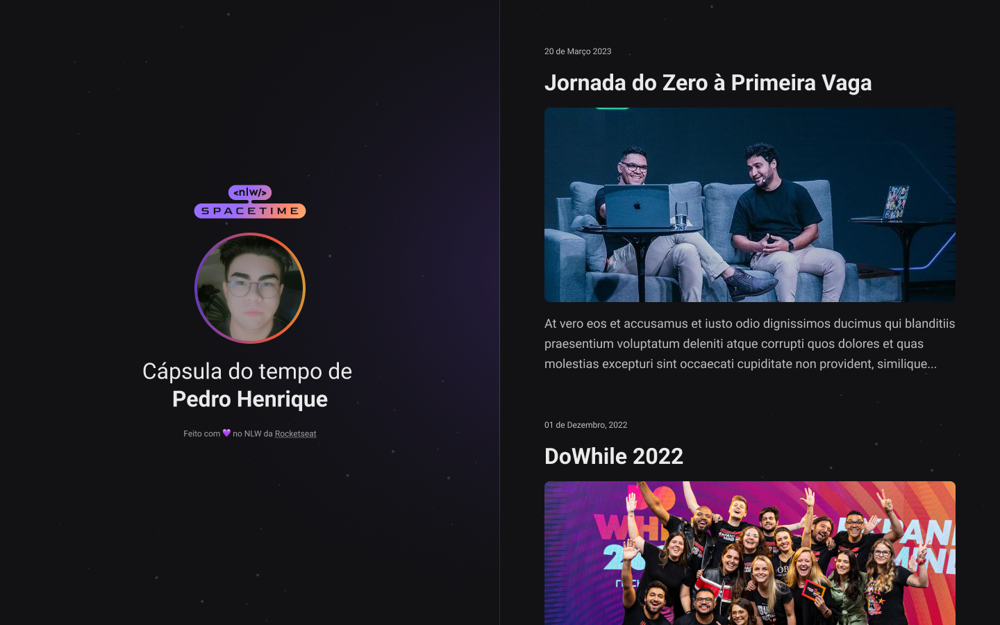

<h1 align="center">NLW 12 - Spacetime</h1>

<p align="center">
  
</p>

## 📒 Descrição

Esse é um projeto Web Responsivo de uma cápsula do tempo para exibir memórias em uma linha do tempo.

## 💻 Pré-requisitos
Antes de começar, verifique se você atendeu aos seguintes requisitos:

- Você tem uma máquina ```<Windows / Linux / Mac>```

## 🚀 Tecnologias

Esse projeto foi desenvolvido durante o NLW da Rocketseat com as seguintes tecnologias:

- HTML
- CSS

- [Visite o projeto online](https://nlw12-spacetime.vercel.app)

## 🏷️ Layout
Você pode visualizar o layoout do projeto através 
[DESSE LINK](https://www.figma.com/file/xllhBAkuLVflqR1WB9SzTj/Capsula-do-Tempo---Trilha-Explorer?type=design&node-id=306%3A3&t=l2mqywaCaALXnqil-1). 
É necessário ter uma conta no [Figma](https://www.figma.com)

## :memo: Licença

Esse projeto está sob a licença MIT.

## 🛠 Como rodar a aplicação

```bash
# clonar o repositório

# por HTTPS
$ git clone https://github.com/pedrodev30/nlw12-spacetime.git

# por chave SSH
$ git clone git@github.com:pedrodev30/nlw12-spacetime.git

# vai entrar na pasta do projeto
$ cd na pasta projeto

# abrir a pasta do projeto no seu editor
$ Abra a pasta no Visual Studio Code ou editor de sua Preferência

# Live Server é uma extensão do Vs Code que executa o arquivo no seu navegador
$ Agora abra o arquivo index.html com o live Server
```

---


<p align="center">
  Feito com 💜 por Pedro Henrique
</p>